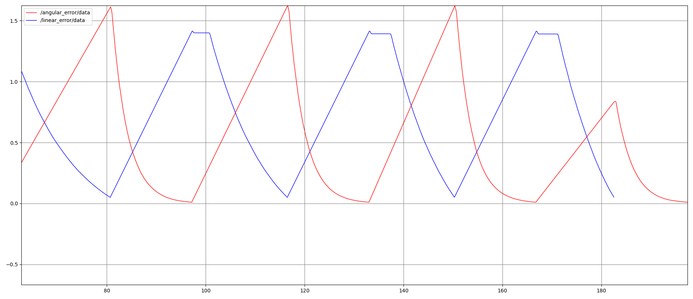

### Rectangular path:
```
ros2 run car_controller controller --path "0,0,0;1,0,0;1,1,1.57;0,1,3.14;0,0,0"
```

### Diagonal path:
```
ros2 run car_controller controller --path "0,0,0.7854;1,1,2.3562;0,2,3.9269;-1,1,5.4977;0,0,0"
```


### Circular path:
```
ros2 run car_controller controller --path "0,0,0;1,1,1.570;0,2,3.1415;-1,1,4.712;0,0,0" --circular True
```


## Commands for the demo
open gazebo with turtlebot:
```
export TURTLEBOT3_MODEL=waffle_pi; ros2 launch turtlebot3_gazebo empty_world.launch.py
```

Teleop for turtlebot3
```
ros2 run turtlebot3_teleop teleop_keyboard
+
ros2 bag record -o turtle_vel.bag /cmd_vel
+
ros2 bag record play turtle_vel.bag
```

## linear and angular errors on rqt_plot for diagonal path


